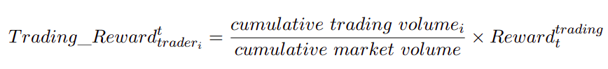

# Reward Tracker Smart Contract

### Install dependencies
```sh
npm install
```

### Compile contracts
```sh
npx hardhat compile
```

### Run tests
```sh
npx hardhat test
```

### Задача

Есть децентрализованная биржа деривативов, которая позволяет трейдеру открывать и закрывать позиции с плечом. Необходимо добавить функционал “вознаграждений” в виде отдельного контракта. Трейдер должен получать вознаграждение в виде отдельного ERC20 токена. Вознаграждение рассчитывается за период (который может меняться - но по умолчанию он равен 1 месяцу = 2592000 секунд). Трейдер получает вознаграждение только если совершал операции (открывал или закрывал позицию) за период. Если в новом периоде трейдер не совершал операции, но при этом позиция все еще открыта - вознаграждение НЕ начисляется. Трейдер получает вознаграждение по запросу (функция claim) \


Ограничения на решение:

* Алгоритм должен быть полностью on-chain
* И полностью децентрализованным: все вычисления совершаются в момент выполнения операций трейдером.
* Сложность: O(1). Использовать **циклы для обхода трейдеров НЕЛЬЗЯ**. Кол-во трейдеров не ограничено - соответственно цикл может не выполниться из-за block gas limit.
* Внешние (off-chain) **скрипты (киперы) использовать нельзя**.
* Все данные также должны храниться в контракте.
* Стэк: hardhat (typescript) + solidity
* Контракт должен быть покрыт тестами. Смена периодов также должна быть покрыта тестами.

**Термины:**


* **Trader** - отдельный кошелек, который выполняет операции на бирже
* **Period** - время, по истечении которого вознаграждения перестают начисляться, если трейдер не совершает операции. В данной задаче взять 30 дней (2592000 секунд). Период рассчитывается с момента создания контракта.
* **Notional** - размер позиции ( например 100 000 USDC)
* **Reward token** - отдельный ERC20 токен (в данной задаче просто создать Mock унаследованный от ERC20), в котором трейдер получает вознаграждения за операции.
* **Cumulative trading volume (for trader i)** - суммарный объем торгов для данного трейдера за период:
    * Пример:
        * Трейдер совершал операции за период 100K long, 50K short, 60K long
        * **Cumulative trading volume = 100K + 50K + 60K = 210K**
* **Cumulative market volume (for market j)** - суммарный объем торгов для данного рынка за период:
    * Пример:
    * Трейдер 1 за 30 дней для рынка A: **Cumulative trading volume = 200K**
    * Трейдер 2 за 30 дней для рынка A: **Cumulative trading volume = 50K**
    * **Cumulative market volume = 200K + 50K = 250K**
* **Reward(i)** - коэффициент (для данной задачи взять равным 0.387), указывающий кол-во **Reward Token’ов** в секунду для всех трейдеров.

**Формула расчета вознаграждения трейдера:**




**Пример:**


* Period = 2592000 секунд
* **Reward(i) = **0.387

**Период1:**

**T1**:


* Trader1: открывает позицию 100K long

**T2**:


* Trader2: открывают позицию 50K short

**T3:**


* Trader3: открывает позицию 100K long

**T4:**


* Trader2: закрывает 50% позиции 25K long

Output:


* **Cumulative_trading_volume(trader1) = 100 000**
* **Cumulative_trading_volume(trader2) = 75 000**
* **Cumulative_trading_volume(trader3) = 100 000**
* **Cumulative_market_volume = 275 000**

**Период2:**

**T5:**


* Trader4: открывает позицию 100K short

**T6:**


* Trader2: закрывает 50% остатка позиции 25K long

Output:


* **Cumulative_trading_volume(trader1) = 0**
* **Cumulative_trading_volume(trader2) = 25 000**
* **Cumulative_trading_volume(trader3) = 0**
* **Cumulative_trading_volume(trader4) = 100 000**
* **Cumulative_market_volume = 125 000**

**Период3:**

**T7:**


* Trader1 закрывает позицию 100K short

Output:


* **Cumulative_trading_volume(trader1) = 100 000**
* **Cumulative_trading_volume(trader2) = 0**
* **Cumulative_trading_volume(trader3) = 0**
* **Cumulative_trading_volume(trader4) = 0**
* **Cumulative_market_volume = 100 000**

**Период4:**

**T8:**


* Никто не делает операции за период

Output:


* **Cumulative_trading_volume(trader1) = 0**
* **Cumulative_trading_volume(trader2) = 0**
* **Cumulative_trading_volume(trader3) = 0**
* **Cumulative_trading_volume(trader4) = 0**
* **Cumulative_market_volume = 0**

**Период5:**

**T9:**


* Trader1  вызывает claim для получения вознаграждения
* Trader2  вызывает claim для получения вознаграждения
* Trader3  вызывает claim для получения вознаграждения
* Trader4  вызывает claim для получения вознаграждения

Output:


* **Cumulative_trading_volume(trader1) = 0**
* **Cumulative_trading_volume(trader2) = 0**
* **Cumulative_trading_volume(trader3) = 0**
* **Cumulative_trading_volume(trader4) = 0**
* **Cumulative_market_volume = 0**

**Расчет вознаграждений в момент CLAIM:**

**Trader1_total_reward** = 0.387 * ( (T2-T1) * 100K / 100K + (T3-T2) * 100K / 150K + (T4-T3) * 100K / 250K + (T5 - T4) * 100K / 275K) + 0.387 * 0 + 0.387 * ( (T8-T7) * 100K / 100K)

**Trader2_total_reward** = 0.387 * ( (T3-T2) * 50K / 150K + (T4-T3) * 50K / 250K + (T5 - T4) * 75K / 275K) + 0.387 * ((T7-T6) * 25K / 125K )

**Trader3_total_reward** = 0.387 * ( (T4-T3) * 100K / 250K + (T5 - T4) * 100K / 275K)

**Trader4_total_reward** = 0.387 * ( (T6-T5) * 100K / 100K + (T7 - T6) * 100K / 125K )
